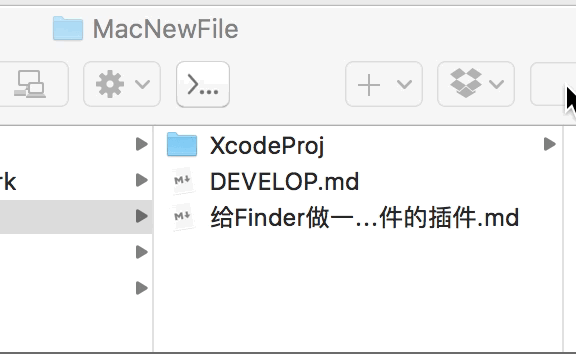

# MacNewFile
MacOS finder's new file plugin, supporting user defined new file template.

可以自定义模板文件的Finder新建文件插件

### Download

[macnewfile-1.0.dmg](https://github.com/majoressense/macnewfile/releases/tag/v1.0)

### Setup

- Install

  Open DMG file, drag .app to Applications

- Open MacNewFile.app

  Click the "Here" button to open the folder

- Put your new file templates at the folder

- Enjoy with Finder

  ​

## Liscense

DO WHAT EVER YOU WANT WITH NO WARRANTY

