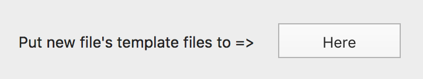
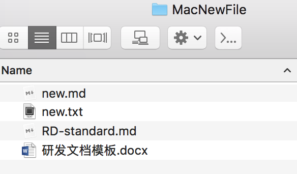
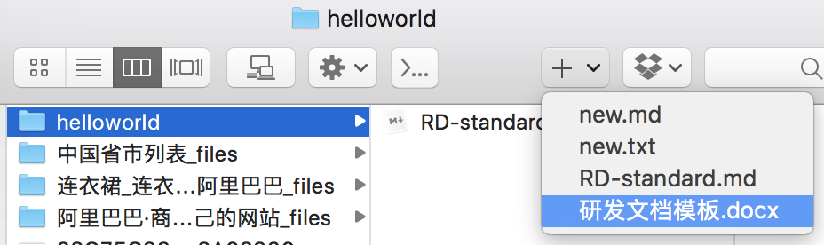

# MacNewFile

### Download

### Setup

- Install

  Open DMG file, drag .app to Applications

- Open MacNewFile.app

  Click the "Here" button to open the folder

  

- Put your new file templates at the folder

  

- Enjoy with Finder

  

